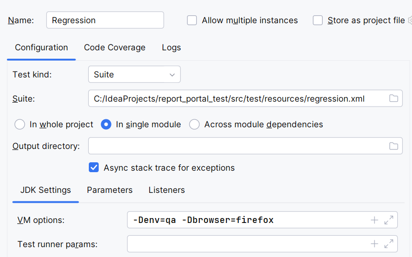
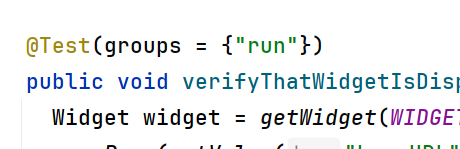
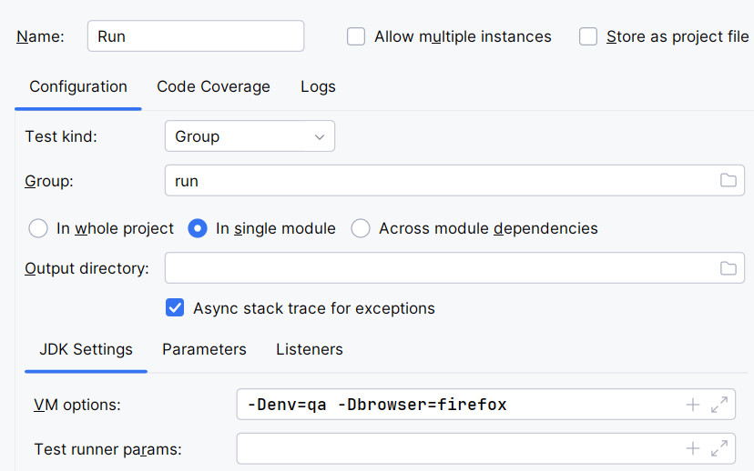

Running All Tests

1. Using Maven:
mvn clean test -Denv=qa -Dbrowser=firefox -DtestSuite=regression
2. Using TestNG:
   Create a run configuration as shown in the screenshot below:

Running Selected Tests (by Group)
Add the tests you want to execute into the run group.

1. Using Maven:
mvn clean test -Denv=qa -Dbrowser=firefox -DtestSuite=regression -Dgroups=run
2. Using TestNG:
   Create a run configuration as shown in the screenshot below:

Generating Allure Report
allure serve {project path}\report_portal_test\allure-results

